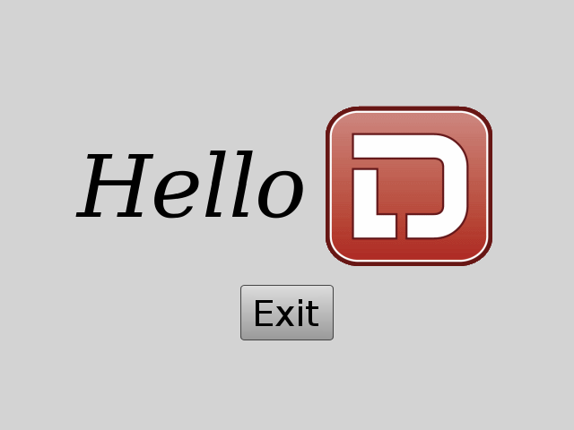

# D GUI Toolkit

## Toolkit highlights

 - Widget toolkit (called `View`s)
 - native support for transforms and animations
 - full styling with CSS
 - Widgets sync with a 2D scene graph that lives in a render thread
 - Using [gfx-d](https://github.com/rtbo/gfx-d) (hardware renderer) to composite the SG nodes together

## Screenshot

## Runtime Dependencies

 - Freetype
 - Harfbuzz
 - Fontconfig
 - libpng
 - turbojpeg
 - Cairo (might move out)
